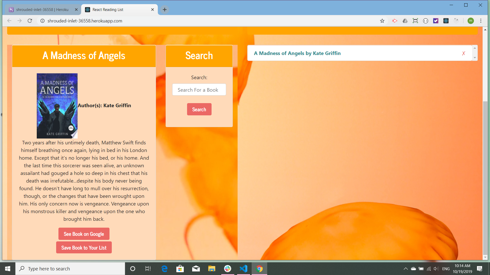

# GoogleBooksReact

Google books react is a creat-react-app application that searches Google books for a book's title and returns information about the book.

The app opens with a search engine and a proxy search "A Madness of Angels(American title: "Electric Blue Angels")" by Kate Griffin.

If the user enters in a title, for example Terry Pratchet's the Light Fantastatic, the app returns a short synopsis of the book and the option to save the book. If this option is selected, the book is saved in a Mongo database.

Finally, if the user wishes to revisit the particulars of the chosen book, he or she can click on it and the database will return the information.

